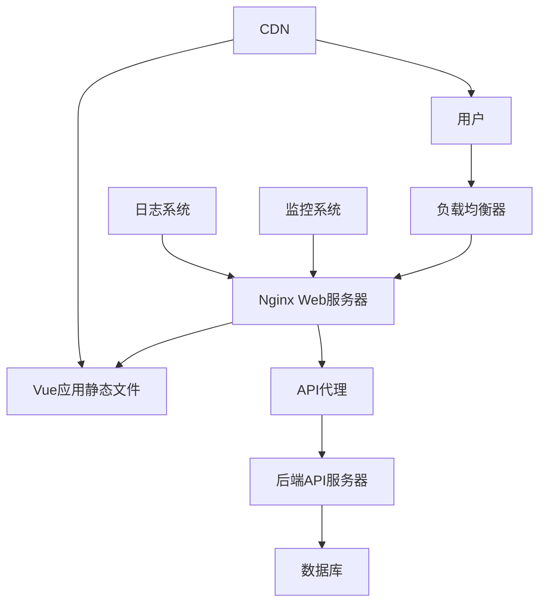

# 部署文档

## 📋 文档概述

本文档详细说明东北林业大学智慧车行数据可视化平台的部署方案、环境配置、运维流程和监控策略，帮助运维人员快速、安全地部署和维护系统。

## 🏗️ 部署架构

### 生产环境架构



### 服务器角色说明

| 服务器类型 | 用途 | 配置要求 | 数量 |
|-----------|------|----------|------|
| Web服务器 | 静态文件服务、API代理 | 4核8G，100G SSD | 2台（主备） |
| API服务器 | 后端API服务 | 8核16G，200G SSD | 2台（集群） |
| 数据库服务器 | 数据存储 | 8核32G，500G SSD | 1台（主）+1台（从） |
| 监控服务器 | 系统监控、日志收集 | 4核8G，100G SSD | 1台 |

## 🔧 环境要求

### 服务器系统要求

**操作系统**：
- **推荐**: CentOS 7.9+ / Ubuntu 20.04+
- **可选**: Windows Server 2019+ / RHEL 8+

**硬件要求**：

#### Web服务器
- CPU: 4核心 2.0GHz+
- 内存: 8GB RAM
- 存储: 100GB SSD
- 网络: 100Mbps+

#### API服务器
- CPU: 8核心 2.4GHz+
- 内存: 16GB RAM
- 存储: 200GB SSD
- 网络: 1Gbps+

#### 数据库服务器
- CPU: 8核心 2.4GHz+
- 内存: 32GB RAM
- 存储: 500GB SSD + 2TB HDD
- 网络: 1Gbps+

### 软件依赖

**Web服务器必需软件**：
```bash
# Nginx (推荐版本)
nginx >= 1.18.0

# Node.js (构建环境)
node >= 14.0.0
npm >= 6.0.0

# Git
git >= 2.20.0
```

**系统工具**：
```bash
# 压缩工具
zip unzip

# 网络工具
curl wget telnet

# 系统监控
htop iotop nethogs

# 日志工具
logrotate rsyslog
```

## 📦 应用部署

### 1. 代码部署流程

#### 1.1 环境准备
```bash
# 创建应用用户
sudo useradd -m -s /bin/bash deploy
sudo usermod -aG sudo deploy

# 切换到部署用户
sudo su - deploy

# 创建应用目录
mkdir -p /opt/apps/big-screen
mkdir -p /opt/logs/big-screen
mkdir -p /opt/backup/big-screen
```

#### 1.2 代码获取
```bash
# 克隆代码仓库
cd /opt/apps/big-screen
git clone https://github.com/nefu/big-screen-vue-datav.git .

# 切换到指定版本
git checkout v2.1.0

# 创建生产环境配置
cp .env.example .env.production
```

#### 1.3 依赖安装和构建
```bash
# 安装Node.js依赖
npm install --production=false

# 构建生产版本
npm run build

# 验证构建结果
ls -la dist/
```

### 2. Nginx配置

#### 2.1 安装Nginx
```bash
# CentOS/RHEL
sudo yum install nginx -y

# Ubuntu/Debian
sudo apt-get update
sudo apt-get install nginx -y

# 启动并设置开机自启
sudo systemctl start nginx
sudo systemctl enable nginx
```

#### 2.2 配置文件
```nginx
# /etc/nginx/sites-available/big-screen
server {
    listen 80;
    server_name big-screen.nefu.edu.cn;

    # 重定向到HTTPS
    return 301 https://$server_name$request_uri;
}

server {
    listen 443 ssl http2;
    server_name big-screen.nefu.edu.cn;

    # SSL证书配置
    ssl_certificate /etc/ssl/certs/big-screen.crt;
    ssl_certificate_key /etc/ssl/private/big-screen.key;
    ssl_protocols TLSv1.2 TLSv1.3;
    ssl_ciphers ECDHE-RSA-AES256-GCM-SHA512:DHE-RSA-AES256-GCM-SHA512;
    ssl_prefer_server_ciphers off;

    # 静态文件配置
    root /opt/apps/big-screen/dist;
    index index.html;

    # 安全头
    add_header X-Frame-Options "SAMEORIGIN" always;
    add_header X-XSS-Protection "1; mode=block" always;
    add_header X-Content-Type-Options "nosniff" always;
    add_header Referrer-Policy "no-referrer-when-downgrade" always;
    add_header Content-Security-Policy "default-src 'self' http: https: data: blob: 'unsafe-inline'" always;

    # Gzip压缩
    gzip on;
    gzip_vary on;
    gzip_min_length 1024;
    gzip_proxied expired no-cache no-store private must-revalidate auth;
    gzip_types
        text/plain
        text/css
        text/xml
        text/javascript
        application/javascript
        application/xml+rss
        application/json;

    # 静态资源缓存
    location ~* \.(js|css|png|jpg|jpeg|gif|ico|svg)$ {
        expires 1y;
        add_header Cache-Control "public, immutable";
    }

    # Vue Router History模式配置
    location / {
        try_files $uri $uri/ /index.html;
    }

    # API代理配置
    location /api/ {
        proxy_pass http://api-backend:8675/parking/;
        proxy_set_header Host $host;
        proxy_set_header X-Real-IP $remote_addr;
        proxy_set_header X-Forwarded-For $proxy_add_x_forwarded_for;
        proxy_set_header X-Forwarded-Proto $scheme;

        # 超时配置
        proxy_connect_timeout 30s;
        proxy_send_timeout 30s;
        proxy_read_timeout 30s;

        # 缓存配置
        proxy_buffering on;
        proxy_cache_valid 200 5m;
    }

    # WebSocket代理配置
    location /ws/ {
        proxy_pass http://api-backend:8675/ws/;
        proxy_http_version 1.1;
        proxy_set_header Upgrade $http_upgrade;
        proxy_set_header Connection "upgrade";
        proxy_set_header Host $host;
        proxy_set_header X-Real-IP $remote_addr;
        proxy_set_header X-Forwarded-For $proxy_add_x_forwarded_for;
        proxy_set_header X-Forwarded-Proto $scheme;
    }

    # 健康检查
    location /health {
        access_log off;
        return 200 "healthy\n";
        add_header Content-Type text/plain;
    }

    # 禁止访问敏感文件
    location ~ /\. {
        deny all;
    }

    # 日志配置
    access_log /var/log/nginx/big-screen.access.log;
    error_log /var/log/nginx/big-screen.error.log;
}
```

#### 2.3 启用配置
```bash
# 创建软链接
sudo ln -s /etc/nginx/sites-available/big-screen /etc/nginx/sites-enabled/

# 测试配置
sudo nginx -t

# 重载配置
sudo systemctl reload nginx
```

### 3. SSL证书配置

#### 3.1 Let's Encrypt免费证书
```bash
# 安装certbot
sudo yum install certbot python3-certbot-nginx -y

# 获取证书
sudo certbot --nginx -d big-screen.nefu.edu.cn

# 设置自动续期
echo "0 12 * * * /usr/bin/certbot renew --quiet" | sudo crontab -
```

#### 3.2 自签名证书（开发环境）
```bash
# 创建证书目录
sudo mkdir -p /etc/ssl/private

# 生成私钥
sudo openssl genrsa -out /etc/ssl/private/big-screen.key 2048

# 生成证书
sudo openssl req -new -x509 -key /etc/ssl/private/big-screen.key \
    -out /etc/ssl/certs/big-screen.crt \
    -days 365 \
    -subj "/C=CN/ST=Heilongjiang/L=Harbin/O=NEFU/CN=big-screen.nefu.edu.cn"
```

## 🔧 自动化部署

### 1. 部署脚本

#### 1.1 部署脚本
```bash
#!/bin/bash
# deploy.sh - 自动化部署脚本

set -e

# 配置变量
APP_NAME="big-screen"
APP_DIR="/opt/apps/big-screen"
BACKUP_DIR="/opt/backup/big-screen"
LOG_FILE="/opt/logs/big-screen/deploy.log"
NGINX_CONFIG="/etc/nginx/sites-available/big-screen"

# 日志函数
log() {
    echo "[$(date '+%Y-%m-%d %H:%M:%S')] $1" | tee -a "$LOG_FILE"
}

# 错误处理
error_exit() {
    log "ERROR: $1"
    exit 1
}

# 检查权限
check_permissions() {
    if [[ $EUID -ne 0 ]]; then
        error_exit "此脚本需要root权限运行"
    fi
}

# 备份当前版本
backup_current() {
    if [ -d "$APP_DIR/dist" ]; then
        log "备份当前版本..."
        BACKUP_PATH="$BACKUP_DIR/backup-$(date +%Y%m%d-%H%M%S)"
        mkdir -p "$BACKUP_PATH"
        cp -r "$APP_DIR/dist" "$BACKUP_PATH/"
        log "备份完成: $BACKUP_PATH"
    fi
}

# 更新代码
update_code() {
    log "更新代码..."
    cd "$APP_DIR"

    # 拉取最新代码
    git fetch origin
    git pull origin main

    # 检出指定版本（如果有）
    if [ -n "$VERSION" ]; then
        git checkout "$VERSION"
    fi

    log "代码更新完成"
}

# 安装依赖
install_dependencies() {
    log "安装依赖..."
    cd "$APP_DIR"
    npm install --production=false
    log "依赖安装完成"
}

# 构建应用
build_app() {
    log "构建应用..."
    cd "$APP_DIR"

    # 设置生产环境变量
    export NODE_ENV=production
    export VUE_APP_API_BASE_URL="https://big-screen.nefu.edu.cn/api"
    export VUE_APP_WS_URL="wss://big-screen.nefu.edu.cn/ws"

    # 执行构建
    npm run build

    # 验证构建结果
    if [ ! -d "$APP_DIR/dist" ] || [ -z "$(ls -A $APP_DIR/dist)" ]; then
        error_exit "构建失败，dist目录为空"
    fi

    log "应用构建完成"
}

# 健康检查
health_check() {
    log "执行健康检查..."

    # 检查Nginx配置
    if ! nginx -t; then
        error_exit "Nginx配置验证失败"
    fi

    # 检查文件权限
    chown -R www-data:www-data "$APP_DIR/dist"
    chmod -R 755 "$APP_DIR/dist"

    # 重载Nginx
    systemctl reload nginx

    # 等待服务启动
    sleep 5

    # 检查应用状态
    if curl -f http://localhost/health > /dev/null 2>&1; then
        log "健康检查通过"
    else
        error_exit "健康检查失败"
    fi
}

# 清理旧备份
cleanup_backups() {
    log "清理旧备份..."
    find "$BACKUP_DIR" -type d -name "backup-*" -mtime +7 -exec rm -rf {} \;
    log "备份清理完成"
}

# 主函数
main() {
    log "开始部署应用: $APP_NAME"

    check_permissions
    backup_current
    update_code
    install_dependencies
    build_app
    health_check
    cleanup_backups

    log "部署完成!"
}

# 执行主函数
main "$@"
```

#### 1.2 回滚脚本
```bash
#!/bin/bash
# rollback.sh - 回滚脚本

set -e

APP_DIR="/opt/apps/big-screen"
BACKUP_DIR="/opt/backup/big-screen"

# 获取最新的备份
LATEST_BACKUP=$(ls -t "$BACKUP_DIR" | head -n1)

if [ -z "$LATEST_BACKUP" ]; then
    echo "没有找到备份文件"
    exit 1
fi

echo "回滚到备份: $LATEST_BACKUP"

# 停止服务
systemctl stop nginx

# 恢复备份
rm -rf "$APP_DIR/dist"
cp -r "$BACKUP_DIR/$LATEST_BACKUP/dist" "$APP_DIR/"

# 启动服务
systemctl start nginx

echo "回滚完成"
```

### 2. CI/CD配置

#### 2.1 GitHub Actions
```yaml
# .github/workflows/deploy.yml
name: Deploy to Production

on:
  push:
    branches: [ main ]
    tags: [ 'v*' ]

jobs:
  build-and-deploy:
    runs-on: ubuntu-latest

    steps:
    - name: Checkout code
      uses: actions/checkout@v3

    - name: Setup Node.js
      uses: actions/setup-node@v3
      with:
        node-version: '16'
        cache: 'npm'

    - name: Install dependencies
      run: npm ci

    - name: Run tests
      run: npm run test:unit

    - name: Build application
      run: npm run build
      env:
        NODE_ENV: production
        VUE_APP_API_BASE_URL: ${{ secrets.API_BASE_URL }}

    - name: Deploy to server
      uses: appleboy/ssh-action@v0.1.5
      with:
        host: ${{ secrets.HOST }}
        username: ${{ secrets.USERNAME }}
        key: ${{ secrets.SSH_KEY }}
        script: |
          cd /opt/apps/big-screen
          git pull origin main
          npm ci --only=production
          npm run build
          sudo systemctl reload nginx

    - name: Health check
      run: |
        sleep 30
        curl -f ${{ secrets.HEALTH_CHECK_URL }}
```

## 📊 监控和日志

### 1. 系统监控

#### 1.1 Prometheus监控配置
```yaml
# prometheus.yml
global:
  scrape_interval: 15s

scrape_configs:
  - job_name: 'nginx'
    static_configs:
      - targets: ['localhost:9113']

  - job_name: 'node-exporter'
    static_configs:
      - targets: ['localhost:9100']

  - job_name: 'big-screen'
    static_configs:
      - targets: ['localhost:3000']
    metrics_path: '/metrics'
```

#### 1.2 Grafana仪表板
```json
{
  "dashboard": {
    "title": "大屏应用监控",
    "panels": [
      {
        "title": "HTTP请求率",
        "type": "graph",
        "targets": [
          {
            "expr": "rate(http_requests_total[5m])"
          }
        ]
      },
      {
        "title": "响应时间",
        "type": "graph",
        "targets": [
          {
            "expr": "histogram_quantile(0.95, http_request_duration_seconds_bucket)"
          }
        ]
      }
    ]
  }
}
```

### 2. 日志管理

#### 2.1 Nginx日志配置
```nginx
# 日志格式定义
log_format main '$remote_addr - $remote_user [$time_local] "$request" '
                '$status $body_bytes_sent "$http_referer" '
                '"$http_user_agent" "$http_x_forwarded_for" '
                'rt=$request_time uct="$upstream_connect_time" '
                'uht="$upstream_header_time" urt="$upstream_response_time"';

# 访问日志
access_log /var/log/nginx/big-screen.access.log main;

# 错误日志
error_log /var/log/nginx/big-screen.error.log warn;
```

#### 2.2 日志轮转配置
```bash
# /etc/logrotate.d/big-screen
/var/log/nginx/big-screen.*.log {
    daily
    missingok
    rotate 30
    compress
    delaycompress
    notifempty
    create 644 www-data www-data
    postrotate
        systemctl reload nginx
    endscript
}
```

#### 2.3 应用日志
```javascript
// src/utils/logger.js
class Logger {
  constructor(level = 'info') {
    this.level = level
  }

  debug(message, data = null) {
    if (this.shouldLog('debug')) {
      console.debug(`[DEBUG] ${message}`, data)
    }
  }

  info(message, data = null) {
    if (this.shouldLog('info')) {
      console.info(`[INFO] ${message}`, data)
    }
  }

  warn(message, data = null) {
    if (this.shouldLog('warn')) {
      console.warn(`[WARN] ${message}`, data)
    }
  }

  error(message, error = null) {
    if (this.shouldLog('error')) {
      console.error(`[ERROR] ${message}`, error)

      // 发送错误到监控系统
      this.sendToMonitoring(message, error)
    }
  }

  shouldLog(level) {
    const levels = ['debug', 'info', 'warn', 'error']
    return levels.indexOf(level) >= levels.indexOf(this.level)
  }

  sendToMonitoring(message, error) {
    // 发送到监控系统
    if (window.Sentry) {
      window.Sentry.captureException(error || new Error(message))
    }
  }
}

export default new Logger(process.env.NODE_ENV === 'production' ? 'info' : 'debug')
```

## 🔒 安全配置

### 1. 防火墙配置

```bash
# 安装firewalld
sudo yum install firewalld -y
sudo systemctl start firewalld
sudo systemctl enable firewalld

# 开放必要端口
sudo firewall-cmd --permanent --add-service=http
sudo firewall-cmd --permanent --add-service=https
sudo firewall-cmd --permanent --add-port=22/tcp

# 限制API访问
sudo firewall-cmd --permanent --add-rich-rule='rule family="ipv4" source address="192.168.1.0/24" port protocol="tcp" port="8675" accept'

# 重载防火墙
sudo firewall-cmd --reload
```

### 2. 安全加固

#### 2.1 Nginx安全配置
```nginx
# 隐藏Nginx版本
server_tokens off;

# 限制请求大小
client_max_body_size 10M;

# 限制请求频率
limit_req_zone $binary_remote_addr zone=api:10m rate=10r/s;
limit_req zone=api burst=20 nodelay;

# 防止DDoS
limit_conn_zone $binary_remote_addr zone=conn_limit_per_ip:10m;
limit_conn conn_limit_per_ip 20;

# 安全头
add_header Strict-Transport-Security "max-age=31536000; includeSubDomains" always;
add_header X-Frame-Options "DENY" always;
add_header X-Content-Type-Options "nosniff" always;
add_header X-XSS-Protection "1; mode=block" always;
add_header Referrer-Policy "strict-origin-when-cross-origin" always;
```

#### 2.2 文件权限
```bash
# 设置应用文件权限
sudo chown -R www-data:www-data /opt/apps/big-screen
sudo chmod -R 755 /opt/apps/big-screen/dist
sudo chmod 644 /opt/apps/big-screen/dist/*.*
sudo chmod 755 /opt/apps/big-screen/dist/static

# 设置日志权限
sudo chown -R www-data:adm /var/log/nginx
sudo chmod 755 /var/log/nginx
sudo chmod 644 /var/log/nginx/*.log
```

### 3. HTTPS配置

```nginx
# 强制HTTPS
if ($scheme != "https") {
    return 301 https://$host$request_uri;
}

# HSTS
add_header Strict-Transport-Security "max-age=31536000; includeSubDomains; preload" always;

# 完美前向保密
ssl_ecdh_curve secp384r1;

# OCSP装订
ssl_stapling on;
ssl_stapling_verify on;
resolver 8.8.8.8 8.8.4.4 valid=300s;
resolver_timeout 5s;
```

## 📈 性能优化

### 1. 缓存策略

#### 1.1 浏览器缓存
```nginx
# 静态资源长期缓存
location ~* \.(js|css|png|jpg|jpeg|gif|ico|svg|woff|woff2|ttf|eot)$ {
    expires 1y;
    add_header Cache-Control "public, immutable";
    add_header Vary Accept-Encoding;
}

# HTML文件不缓存
location ~* \.html$ {
    expires -1;
    add_header Cache-Control "no-cache, no-store, must-revalidate";
    add_header Pragma "no-cache";
}
```

#### 1.2 CDN配置
```nginx
# CDN回源配置
location ~* \.(js|css|png|jpg|jpeg|gif|ico|svg)$ {
    # 检查CDN回源请求
    if ($http_cf_connecting_ip) {
        add_header X-CDN-Cache-Status $upstream_cache_status;
    }

    expires 1y;
    add_header Cache-Control "public, immutable";
}
```

### 2. 压缩优化

```nginx
# 启用Brotli压缩（需要编译nginx时支持）
brotli on;
brotli_comp_level 6;
brotli_types text/plain text/css application/json application/javascript text/xml application/xml application/xml+rss text/javascript;

# Gzip压缩作为备用
gzip on;
gzip_vary on;
gzip_min_length 1000;
gzip_proxied any;
gzip_comp_level 6;
gzip_types
    application/atom+xml
    application/javascript
    application/json
    application/rss+xml
    application/vnd.ms-fontobject
    application/x-font-ttf
    application/x-web-app-manifest+json
    application/xhtml+xml
    application/xml
    font/opentype
    image/svg+xml
    image/x-icon
    text/css
    text/plain
    text/x-component;
```

### 3. 连接优化

```nginx
# 工作进程数
worker_processes auto;

# 连接数配置
events {
    worker_connections 1024;
    use epoll;
    multi_accept on;
}

# Keep-Alive配置
keepalive_timeout 65;
keepalive_requests 100;

# TCP优化
tcp_nopush on;
tcp_nodelay on;
```

## 🚨 故障处理

### 1. 常见问题排查

#### 1.1 应用无法访问
```bash
# 检查Nginx状态
sudo systemctl status nginx

# 检查端口监听
sudo netstat -tlnp | grep :80
sudo netstat -tlnp | grep :443

# 检查配置文件
sudo nginx -t

# 查看错误日志
sudo tail -f /var/log/nginx/error.log
```

#### 1.2 API请求失败
```bash
# 检查后端服务状态
curl -I http://api-backend:8675/health

# 检查网络连接
telnet api-backend 8675

# 查看代理日志
sudo tail -f /var/log/nginx/big-screen.access.log
```

#### 1.3 页面加载缓慢
```bash
# 检查系统资源
top
htop
iotop

# 检查网络延迟
ping big-screen.nefu.edu.cn

# 分析加载时间
curl -w "@curl-format.txt" -o /dev/null -s https://big-screen.nefu.edu.cn/
```

### 2. 应急响应流程

#### 2.1 服务故障
```bash
#!/bin/bash
# emergency_response.sh

echo "执行应急响应流程..."

# 1. 检查服务状态
if ! systemctl is-active --quiet nginx; then
    echo "Nginx服务异常，尝试重启..."
    sudo systemctl restart nginx
    sleep 5
fi

# 2. 检查健康状态
if ! curl -f http://localhost/health > /dev/null 2>&1; then
    echo "健康检查失败，执行回滚..."
    ./rollback.sh
fi

# 3. 发送告警
curl -X POST "https://api.telegram.org/bot${TOKEN}/sendMessage" \
    -d chat_id="${CHAT_ID}" \
    -d text="大屏应用故障，已执行应急响应"

echo "应急响应完成"
```

#### 2.2 数据库连接问题
```bash
# 检查数据库连接
mysql -h db-server -u user -p -e "SELECT 1"

# 检查连接池状态
curl http://api-backend:8675/api/status

# 重启应用服务
sudo systemctl restart api-backend
```

### 3. 备份和恢复

#### 3.1 数据备份
```bash
#!/bin/bash
# backup.sh

BACKUP_DIR="/opt/backup/big-screen"
DATE=$(date +%Y%m%d-%H%M%S)

# 创建备份目录
mkdir -p "$BACKUP_DIR/$DATE"

# 备份应用文件
tar -czf "$BACKUP_DIR/$DATE/app.tar.gz" -C /opt/apps big-screen

# 备份配置文件
cp /etc/nginx/sites-available/big-screen "$BACKUP_DIR/$DATE/"

# 备份数据库
mysqldump -h db-server -u user -p database > "$BACKUP_DIR/$DATE/database.sql"

# 清理旧备份（保留30天）
find "$BACKUP_DIR" -type d -mtime +30 -exec rm -rf {} \;

echo "备份完成: $BACKUP_DIR/$DATE"
```

#### 3.2 数据恢复
```bash
#!/bin/bash
# restore.sh

if [ -z "$1" ]; then
    echo "用法: $0 <backup_directory>"
    exit 1
fi

BACKUP_DIR="/opt/backup/big-screen/$1"

if [ ! -d "$BACKUP_DIR" ]; then
    echo "备份目录不存在: $BACKUP_DIR"
    exit 1
fi

# 恢复应用文件
tar -xzf "$BACKUP_DIR/app.tar.gz" -C /opt/apps/

# 恢复配置文件
cp "$BACKUP_DIR/big-screen" /etc/nginx/sites-available/

# 恢复数据库
mysql -h db-server -u user -p database < "$BACKUP_DIR/database.sql"

# 重启服务
sudo systemctl reload nginx
sudo systemctl restart api-backend

echo "恢复完成"
```

## 📋 部署检查清单

### 部署前检查
- [ ] 服务器资源充足
- [ ] 网络连接正常
- [ ] SSL证书有效
- [ ] 备份当前版本
- [ ] 测试环境验证通过

### 部署过程检查
- [ ] 代码更新成功
- [ ] 依赖安装完成
- [ ] 应用构建成功
- [ ] 配置文件正确
- [ ] 服务启动正常

### 部署后检查
- [ ] 网站访问正常
- [ ] API接口响应
- [ ] 数据显示正确
- [ ] 性能指标正常
- [ ] 日志记录正常
- [ ] 监控告警正常

## 📞 联系方式

### 技术支持
- **运维团队**: ops@nefu.edu.cn
- **开发团队**: dev@nefu.edu.cn
- **24小时热线**: 0451-xxxxxxxx

### 应急响应
- **P1级故障**: 立即响应，30分钟内处理
- **P2级故障**: 1小时内响应
- **P3级故障**: 4小时内响应
- **P4级故障**: 24小时内响应

---

本文档将根据实际部署经验持续更新完善。