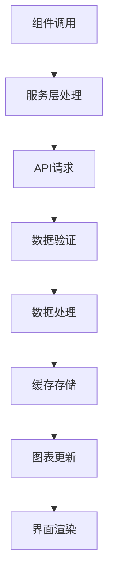
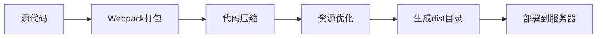

# 技术架构文档

## 📋 文档概述

本文档详细描述了东北林业大学智慧车行数据可视化平台的技术架构、核心组件、数据流和实现细节。旨在为开发团队提供全面的技术参考，便于维护和功能扩展。

## 🏗️ 系统架构

### 整体架构设计

```
┌─────────────────────────────────────────────────────────────┐
│                     前端展示层 (Vue.js)                        │
├─────────────────────────────────────────────────────────────┤
│  主大屏页面    │  3D展示页   │  数据分析页   │  详情展示页    │
├─────────────────────────────────────────────────────────────┤
│                   组件层 (Components)                        │
├─────────────────────────────────────────────────────────────┤
│  图表组件     │  业务组件   │  交互组件   │  布局组件       │
├─────────────────────────────────────────────────────────────┤
│                   服务层 (Services)                          │
├─────────────────────────────────────────────────────────────┤
│ 停车数据服务 │ 车流数据服务 │ 访客VIP服务 │ WebSocket服务  │
├─────────────────────────────────────────────────────────────┤
│                   数据访问层 (Axios)                         │
├─────────────────────────────────────────────────────────────┤
│  HTTP请求    │ WebSocket   │ 错误处理   │ 缓存管理         │
├─────────────────────────────────────────────────────────────┤
│                  后端API接口                                  │
└─────────────────────────────────────────────────────────────┘
```

### 技术栈选择

#### 核心框架
- **Vue 2.7.16**: 采用Vue 2.x最新版本，提供更好的性能和开发体验
  - Composition API支持
  - 更好的TypeScript集成
  - 性能优化

#### 图表库
- **ECharts 4.9.0**: 企业级图表库，功能强大
  - 支持丰富的图表类型
  - 高性能渲染引擎
  - 完善的交互能力
  - 移动端适配

- **@antv/g2plot 2.4.35**: 专业的统计图表库
  - 基于图形语法
  - 高度可定制化
  - 优雅的动画效果

#### UI组件库
- **@jiaminghi/data-view 2.10.0**: 专为数据大屏设计
  - 大屏专用组件
  - 边框、装饰、图表
  - 响应式设计

## 📁 项目结构详解

### 目录结构说明

```
src/
├── assets/                    # 静态资源
│   ├── scss/                 # SCSS样式文件
│   │   ├── _variables.scss   # SCSS变量定义
│   │   ├── index.scss        # 样式入口文件
│   │   └── style.scss        # 全局样式
│   ├── title-bg.png          # 标题背景图
│   ├── logo.png              # 项目Logo
│   └── pageBg.png            # 页面背景图
│
├── components/               # 可复用组件
│   ├── echart/              # 图表组件目录
│   │   ├── centreLeft1Chart.vue      # 左中图表1
│   │   ├── centreLeft2Chart.vue      # 左中图表2
│   │   ├── bottom/                 # 底部图表组件
│   │   │   ├── bottomLeftChart.vue  # 左下图表
│   │   │   └── bottomRightChart.vue # 右下图表
│   │   ├── center/                 # 中心图表组件
│   │   └── visitor/                # 访客相关图表
│   ├── FullScreenContainerFix.vue  # 全屏容器修复组件
│   ├── RealTimeVehicleMonitor.vue  # 实时车辆监控
│   ├── VisitorVipAnalysisModal.vue # 访客VIP分析弹窗
│   ├── WordCloud3D.vue            # 3D词云组件
│   └── VisitorReservationPanel.vue # 访客预约面板
│
├── services/                  # 业务服务层
│   ├── parkingDataService.js          # 停车数据服务
│   ├── vehicleFlowDataService.js      # 车辆流量服务
│   ├── visitorVipDataService.js       # 访客VIP服务
│   ├── websocketService.js            # WebSocket服务
│   └── vehicleDataService.js          # 车辆数据服务
│
├── views/                     # 页面组件
│   ├── index.vue            # 主大屏页面 (905行代码)
│   ├── center.vue           # 中心展示页面
│   ├── centreLeft1.vue      # 左中组件页面
│   ├── centreLeft2.vue      # 左中组件页面2
│   ├── centreRight1.vue     # 右中组件页面1
│   ├── centreRight2.vue     # 右中组件页面2
│   ├── bottomLeft.vue       # 左下组件页面
│   ├── bottomRight.vue      # 右下组件页面
│   ├── channelStats.vue     # 通道统计页面
│   ├── parkingDuration.vue  # 停车时长页面
│   └── ...                  # 其他功能页面
│
├── config/                   # 配置文件
│   └── apiConfig.js         # API接口配置
│
├── utils/                    # 工具函数
│   ├── corsHandler.js       # CORS处理工具
│   └── websocketTest.js     # WebSocket测试工具
│
├── store/                    # Vuex状态管理
│   └── index.js             # Store配置
│
├── router/                   # 路由配置
│   └── index.js             # 路由定义
│
├── main.js                   # 应用入口文件
└── App.vue                   # 根组件
```

### 核心文件说明

#### 1. 主大屏页面 (`src/views/index.vue`)
- **代码行数**: 905行
- **功能描述**: 项目核心页面，展示完整的大屏数据
- **布局方式**: CSS Grid三列布局 (26% 46% 27%)
- **核心功能**:
  - 实时数据展示和更新
  - 时间/通道筛选器控制
  - 弹窗交互管理
  - 核心指标计算和展示
  - 数据缓存和刷新机制

#### 2. 数据服务层 (`src/services/`)

##### 停车数据服务 (`parkingDataService.js`)
```javascript
// 核心方法说明
class ParkingDataService {
  // 获取实时车流数据
  async getRealTimeFlow(timeRange, channelType) {}

  // 获取车辆轨迹数据
  async getVehicleTrajectory(vehicleId) {}

  // 获取24小时趋势分析
  async getHourlyTrend(date) {}

  // 获取停车时长分布
  async getParkingDuration(timeRange) {}

  // 获取收费分析
  async getRevenueAnalysis(timeRange) {}

  // 获取异常监控数据
  async getAnomalyMonitor() {}
}
```

##### 车辆流量服务 (`vehicleFlowDataService.js`)
```javascript
// 车辆流量数据专门服务
class VehicleFlowDataService {
  // 获取车辆流量统计数据
  async getVehicleFlowData(timeRange, channelType) {}

  // 获取通道详细统计
  async getChannelDetailStatistics(channelId) {}

  // 获取详细统计数据
  async getDetailStatistics(timeRange, dimensions) {}
}
```

##### 访客VIP服务 (`visitorVipDataService.js`)
```javascript
// 访客和VIP车辆数据服务
class VisitorVipDataService {
  // 获取访客VIP小时统计数据
  async getHourlyVisitorVipData(date) {}

  // 获取访客VIP详细分析
  async getVisitorVipAnalysis(timeRange) {}
}
```

## 🔧 核心组件详解

### 图表组件架构

#### 1. 图表组件基类设计
```javascript
// 图表组件通用结构
export default {
  name: 'BaseChart',
  props: {
    chartData: { type: Array, required: true },
    chartOptions: { type: Object, default: () => ({}) },
    theme: { type: String, default: 'dark' }
  },
  data() {
    return {
      chart: null,
      resizeObserver: null
    }
  },
  mounted() {
    this.initChart()
    this.setupResizeObserver()
  },
  methods: {
    initChart() {
      // 图表初始化逻辑
    },
    updateChart() {
      // 图表更新逻辑
    },
    setupResizeObserver() {
      // 响应式处理
    }
  }
}
```

#### 2. 主要图表组件

##### 访客VIP堆叠图表 (`VisitorVipStackedChart.vue`)
- **文件路径**: `src/components/echart/visitor/VisitorVipStackedChart.vue`
- **功能描述**: 展示访客和VIP车辆的24小时进出数据
- **技术特点**:
  - 堆叠柱状图展示
  - 支持图例切换
  - 点击事件处理
  - 响应式尺寸适配
  - 动画效果优化

##### 通道流量饼图 (`ChannelFlowPieChart.vue`)
- **文件路径**: `src/components/echart/channel/ChannelFlowPieChart.vue`
- **功能描述**: 展示各通道流量分布情况
- **技术特点**:
  - 环形饼图设计
  - 总览/详细模式切换
  - 自定义标签显示
  - 点击事件触发通道详情弹窗
  - 高亮选中效果

##### 实时车辆监控 (`RealTimeVehicleMonitor.vue`)
- **文件路径**: `src/components/RealTimeVehicleMonitor.vue`
- **功能描述**: 实时监控车辆进出情况
- **技术特点**:
  - WebSocket实时数据连接
  - 自动滚动列表
  - 车辆状态图标显示
  - 异常车辆高亮提醒

## 🎨 样式系统架构

### SCSS架构设计

#### 1. 变量系统 (`src/assets/scss/_variables.scss`)
```scss
// 颜色变量
$primary-color: #1890ff;
$success-color: #52c41a;
$warning-color: #faad14;
$error-color: #f5222d;

// 背景色系
$bg-primary: #0b132a;
$bg-secondary: #1e3a5f;
$bg-tertiary: #2a4766;

// 文字颜色
$text-primary: #ffffff;
$text-secondary: #a0aec0;
$text-muted: #718096;

// 边框颜色
$border-color: #1e3a5f;
$border-light: #2a4766;

// 图表配色
$chart-colors: (
  #1890ff, #2fc25b, #facc14,
  #f04864, #8543e0, #13c2c2,
  #fa8c16, #eb2f96, #722ed1
);

// 尺寸变量
$sidebar-width: 260px;
$header-height: 64px;
$card-padding: 24px;
$grid-gap: 16px;

// 字体大小
$font-size-xs: 12px;
$font-size-sm: 14px;
$font-size-md: 16px;
$font-size-lg: 18px;
$font-size-xl: 24px;

// 圆角
$border-radius-sm: 4px;
$border-radius-md: 6px;
$border-radius-lg: 8px;

// 阴影
$box-shadow-sm: 0 2px 4px rgba(0, 0, 0, 0.1);
$box-shadow-md: 0 4px 8px rgba(0, 0, 0, 0.15);
$box-shadow-lg: 0 8px 16px rgba(0, 0, 0, 0.2);
```

#### 2. 混合器系统
```scss
// flex布局混合器
@mixin flex-center {
  display: flex;
  align-items: center;
  justify-content: center;
}

@mixin flex-between {
  display: flex;
  align-items: center;
  justify-content: space-between;
}

// 文字省略混合器
@mixin text-ellipsis($lines: 1) {
  @if $lines == 1 {
    overflow: hidden;
    text-overflow: ellipsis;
    white-space: nowrap;
  } @else {
    display: -webkit-box;
    -webkit-line-clamp: $lines;
    -webkit-box-orient: vertical;
    overflow: hidden;
  }
}

// 卡片样式混合器
@mixin card-style($padding: $card-padding) {
  background: $bg-secondary;
  border: 1px solid $border-color;
  border-radius: $border-radius-lg;
  padding: $padding;
  box-shadow: $box-shadow-md;
}
```

#### 3. 响应式设计
```scss
// 断点定义
$breakpoints: (
  'xs': 480px,
  'sm': 768px,
  'md': 1024px,
  'lg': 1280px,
  'xl': 1440px,
  'xxl': 1920px
);

// 响应式混合器
@mixin respond-to($breakpoint) {
  @media (min-width: map-get($breakpoints, $breakpoint)) {
    @content;
  }
}

// 大屏适配
@media screen and (max-width: 1920px) {
  .big-screen-container {
    transform: scale(1);
  }
}

@media screen and (max-width: 1680px) {
  .big-screen-container {
    transform: scale(0.875);
  }
}

@media screen and (max-width: 1440px) {
  .big-screen-container {
    transform: scale(0.75);
  }
}
```

## 🔄 数据流架构

### 数据获取流程



### 数据缓存策略

#### 1. 缓存配置
```javascript
// 数据缓存配置
const CACHE_CONFIG = {
  duration: 30 * 1000,  // 30秒缓存
  maxSize: 50,         // 最大缓存条目
  keyPrefix: 'nefu_datav_'
};

// 缓存管理类
class DataCache {
  constructor(config) {
    this.config = config;
    this.cache = new Map();
  }

  set(key, data) {
    this.cache.set(key, {
      data,
      timestamp: Date.now()
    });
  }

  get(key) {
    const item = this.cache.get(key);
    if (!item) return null;

    if (Date.now() - item.timestamp > this.config.duration) {
      this.cache.delete(key);
      return null;
    }

    return item.data;
  }
}
```

#### 2. 重试机制
```javascript
// 请求重试配置
const RETRY_CONFIG = {
  maxRetries: 3,
  retryDelay: 1000,
  retryCondition: (error) => {
    return error.code !== 404 && error.code !== 401;
  }
};

// 重试装饰器
function withRetry(target, propertyKey, descriptor) {
  const originalMethod = descriptor.value;

  descriptor.value = async function(...args) {
    let lastError;

    for (let i = 0; i <= RETRY_CONFIG.maxRetries; i++) {
      try {
        return await originalMethod.apply(this, args);
      } catch (error) {
        lastError = error;

        if (i === RETRY_CONFIG.maxRetries) break;
        if (!RETRY_CONFIG.retryCondition(error)) break;

        await new Promise(resolve =>
          setTimeout(resolve, RETRY_CONFIG.retryDelay * (i + 1))
        );
      }
    }

    throw lastError;
  };

  return descriptor;
}
```

### 实时数据更新

#### 1. WebSocket服务
```javascript
// WebSocket服务类
class WebSocketService {
  constructor(url) {
    this.url = url;
    this.socket = null;
    this.reconnectAttempts = 0;
    this.maxReconnectAttempts = 5;
    this.listeners = new Map();
  }

  connect() {
    this.socket = new WebSocket(this.url);

    this.socket.onopen = () => {
      console.log('WebSocket连接已建立');
      this.reconnectAttempts = 0;
      this.startHeartbeat();
    };

    this.socket.onmessage = (event) => {
      const data = JSON.parse(event.data);
      this.handleMessage(data);
    };

    this.socket.onclose = () => {
      console.log('WebSocket连接已关闭');
      this.reconnect();
    };

    this.socket.onerror = (error) => {
      console.error('WebSocket错误:', error);
    };
  }

  handleMessage(data) {
    const { type, payload } = data;
    const handlers = this.listeners.get(type) || [];
    handlers.forEach(handler => handler(payload));
  }

  subscribe(type, handler) {
    if (!this.listeners.has(type)) {
      this.listeners.set(type, []);
    }
    this.listeners.get(type).push(handler);
  }

  unsubscribe(type, handler) {
    const handlers = this.listeners.get(type);
    if (handlers) {
      const index = handlers.indexOf(handler);
      if (index > -1) {
        handlers.splice(index, 1);
      }
    }
  }
}
```

#### 2. 自动刷新机制
```javascript
// 自动刷新管理器
class AutoRefreshManager {
  constructor(interval = 30000) {
    this.interval = interval;
    this.timers = new Map();
    this.isVisible = true;
    this.setupVisibilityHandler();
  }

  setupVisibilityHandler() {
    document.addEventListener('visibilitychange', () => {
      this.isVisible = !document.hidden;
      if (this.isVisible) {
        this.restartAll();
      } else {
        this.pauseAll();
      }
    });
  }

  start(key, callback) {
    this.stop(key);

    const timer = setInterval(() => {
      if (this.isVisible) {
        callback();
      }
    }, this.interval);

    this.timers.set(key, timer);
  }

  stop(key) {
    const timer = this.timers.get(key);
    if (timer) {
      clearInterval(timer);
      this.timers.delete(key);
    }
  }

  pauseAll() {
    this.timers.forEach(timer => clearInterval(timer));
  }

  restartAll() {
    // 重启所有定时器的逻辑
  }
}
```

## 📊 图表配置系统

### ECharts配置标准化

#### 1. 主题配置
```javascript
// 深色主题配置
export const darkTheme = {
  backgroundColor: 'transparent',
  textStyle: {
    color: '#ffffff'
  },
  title: {
    textStyle: {
      color: '#ffffff'
    }
  },
  legend: {
    textStyle: {
      color: '#ffffff'
    }
  },
  tooltip: {
    backgroundColor: 'rgba(0, 0, 0, 0.8)',
    borderColor: '#1890ff',
    textStyle: {
      color: '#ffffff'
    }
  }
};

// 图表通用配置
export const commonConfig = {
  grid: {
    top: '10%',
    left: '3%',
    right: '4%',
    bottom: '3%',
    containLabel: true
  },
  tooltip: {
    trigger: 'axis',
    backgroundColor: 'rgba(0, 0, 0, 0.8)',
    borderColor: '#1890ff',
    borderWidth: 1,
    textStyle: {
      color: '#ffffff',
      fontSize: 14
    }
  },
  legend: {
    type: 'scroll',
    orient: 'horizontal',
    bottom: 0,
    textStyle: {
      color: '#ffffff',
      fontSize: 12
    }
  }
};
```

#### 2. 图表工厂
```javascript
// 图表工厂类
class ChartFactory {
  static createPieChart(data, options = {}) {
    return {
      ...commonConfig,
      series: [{
        type: 'pie',
        radius: options.radius || ['40%', '70%'],
        center: options.center || ['50%', '50%'],
        data: data,
        emphasis: {
          itemStyle: {
            shadowBlur: 10,
            shadowOffsetX: 0,
            shadowColor: 'rgba(0, 0, 0, 0.5)'
          }
        },
        label: {
          color: '#ffffff',
          fontSize: 12
        },
        labelLine: {
          lineStyle: {
            color: '#ffffff'
          }
        }
      }],
      ...options
    };
  }

  static createBarChart(data, xAxisData, options = {}) {
    return {
      ...commonConfig,
      xAxis: {
        type: 'category',
        data: xAxisData,
        axisLine: {
          lineStyle: {
            color: '#1e3a5f'
          }
        },
        axisLabel: {
          color: '#ffffff',
          fontSize: 12
        }
      },
      yAxis: {
        type: 'value',
        axisLine: {
          lineStyle: {
            color: '#1e3a5f'
          }
        },
        axisLabel: {
          color: '#ffffff',
          fontSize: 12
        },
        splitLine: {
          lineStyle: {
            color: '#1e3a5f',
            type: 'dashed'
          }
        }
      },
      series: [{
        type: 'bar',
        data: data,
        itemStyle: {
          color: new echarts.graphic.LinearGradient(0, 0, 0, 1, [
            { offset: 0, color: '#1890ff' },
            { offset: 1, color: '#0050b3' }
          ])
        },
        emphasis: {
          itemStyle: {
            color: '#40a9ff'
          }
        }
      }],
      ...options
    };
  }

  static createLineChart(data, xAxisData, options = {}) {
    return {
      ...commonConfig,
      xAxis: {
        type: 'category',
        data: xAxisData,
        axisLine: {
          lineStyle: {
            color: '#1e3a5f'
          }
        },
        axisLabel: {
          color: '#ffffff',
          fontSize: 12
        }
      },
      yAxis: {
        type: 'value',
        axisLine: {
          lineStyle: {
            color: '#1e3a5f'
          }
        },
        axisLabel: {
          color: '#ffffff',
          fontSize: 12
        },
        splitLine: {
          lineStyle: {
            color: '#1e3a5f',
            type: 'dashed'
          }
        }
      },
      series: [{
        type: 'line',
        data: data,
        smooth: true,
        symbol: 'circle',
        symbolSize: 6,
        lineStyle: {
          color: '#1890ff',
          width: 3
        },
        itemStyle: {
          color: '#1890ff'
        },
        areaStyle: {
          color: new echarts.graphic.LinearGradient(0, 0, 0, 1, [
            { offset: 0, color: 'rgba(24, 144, 255, 0.3)' },
            { offset: 1, color: 'rgba(24, 144, 255, 0.1)' }
          ])
        }
      }],
      ...options
    };
  }
}
```

## 🔌 API接口架构

### 接口配置管理

#### 1. 环境配置
```javascript
// config/apiConfig.js
const ENV = process.env.NODE_ENV || 'development';

const API_CONFIG = {
  development: {
    baseURL: '/api',
    timeout: 10000,
    retryAttempts: 3,
    retryDelay: 1000
  },
  production: {
    baseURL: 'http://localhost:8675',
    timeout: 10000,
    retryAttempts: 3,
    retryDelay: 1000
  }
};

const currentConfig = API_CONFIG[ENV];

export const API_PREFIX = '/parking/nefuData';
export const BASE_URL = currentConfig.baseURL;
export const TIMEOUT = currentConfig.timeout;
export const RETRY_ATTEMPTS = currentConfig.retryAttempts;
export const RETRY_DELAY = currentConfig.retryDelay;
```

#### 2. 请求拦截器
```javascript
// 请求拦截器配置
axios.interceptors.request.use(
  config => {
    // 添加时间戳防止缓存
    if (config.method === 'get') {
      config.params = {
        ...config.params,
        _t: Date.now()
      };
    }

    // 添加请求标识
    config.headers['X-Requested-With'] = 'XMLHttpRequest';
    config.headers['Content-Type'] = 'application/json';

    // 开发环境添加调试信息
    if (process.env.NODE_ENV === 'development') {
      console.log(`[API Request] ${config.method.toUpperCase()} ${config.url}`, config.data);
    }

    return config;
  },
  error => {
    console.error('[API Request Error]', error);
    return Promise.reject(error);
  }
);

// 响应拦截器配置
axios.interceptors.response.use(
  response => {
    const { data, status, config } = response;

    // 开发环境打印响应信息
    if (process.env.NODE_ENV === 'development') {
      console.log(`[API Response] ${config.method.toUpperCase()} ${config.url}`, data);
    }

    // 统一响应格式处理
    if (data.code === 200) {
      return data.data;
    } else {
      throw new Error(data.message || '请求失败');
    }
  },
  error => {
    console.error('[API Response Error]', error);

    // 统一错误处理
    if (error.response) {
      const { status, data } = error.response;

      switch (status) {
        case 401:
          // 处理未授权
          break;
        case 403:
          // 处理禁止访问
          break;
        case 404:
          // 处理资源不存在
          break;
        case 500:
          // 处理服务器错误
          break;
        default:
          // 其他错误
          break;
      }

      throw new Error(data.message || `HTTP ${status} Error`);
    } else if (error.request) {
      // 网络错误
      throw new Error('网络连接失败，请检查网络设置');
    } else {
      // 其他错误
      throw error;
    }
  }
);
```

## ⚡ 性能优化策略

### 1. 组件懒加载
```javascript
// 路由懒加载
const routes = [
  {
    path: '/',
    name: 'Home',
    component: () => import(/* webpackChunkName: "home" */ '@/views/index.vue')
  },
  {
    path: '/demo3d',
    name: 'Demo3D',
    component: () => import(/* webpackChunkName: "demo3d" */ '@/views/demo3d.vue')
  }
];

// 组件异步加载
export default {
  components: {
    HeavyChart: () => import('@/components/echart/HeavyChart.vue')
  }
}
```

### 2. 图表按需加载
```javascript
// ECharts按需引入
import * as echarts from 'echarts/core';
import { LineChart, BarChart, PieChart } from 'echarts/charts';
import {
  TitleComponent,
  TooltipComponent,
  GridComponent,
  LegendComponent
} from 'echarts/components';

// 注册必需的组件
echarts.use([
  LineChart,
  BarChart,
  PieChart,
  TitleComponent,
  TooltipComponent,
  GridComponent,
  LegendComponent
]);
```

### 3. 数据优化
```javascript
// 数据分页加载
class DataLoader {
  constructor(pageSize = 100) {
    this.pageSize = pageSize;
    this.currentPage = 1;
    this.loading = false;
  }

  async loadPage(page, filters = {}) {
    if (this.loading) return;

    this.loading = true;
    try {
      const offset = (page - 1) * this.pageSize;
      const data = await api.getData({
        offset,
        limit: this.pageSize,
        ...filters
      });

      return data;
    } finally {
      this.loading = false;
    }
  }
}

// 虚拟滚动优化
class VirtualScroll {
  constructor(container, itemHeight, renderItem) {
    this.container = container;
    this.itemHeight = itemHeight;
    this.renderItem = renderItem;
    this.visibleCount = Math.ceil(container.clientHeight / itemHeight);
    this.scrollTop = 0;

    this.setupScrollListener();
  }

  render(data) {
    const startIndex = Math.floor(this.scrollTop / this.itemHeight);
    const endIndex = Math.min(startIndex + this.visibleCount, data.length);

    // 渲染可见项目
    for (let i = startIndex; i < endIndex; i++) {
      this.renderItem(data[i], i);
    }
  }
}
```

## 🔧 开发工具配置

### 1. ESLint配置
```javascript
// .eslintrc.js
module.exports = {
  root: true,
  env: {
    node: true,
    browser: true,
    es6: true
  },
  extends: [
    'plugin:vue/essential',
    '@vue/standard'
  ],
  parserOptions: {
    parser: 'babel-eslint'
  },
  rules: {
    'no-console': process.env.NODE_ENV === 'production' ? 'warn' : 'off',
    'no-debugger': process.env.NODE_ENV === 'production' ? 'warn' : 'off',
    'vue/no-unused-components': 'warn',
    'vue/no-unused-vars': 'warn',
    'indent': ['error', 2],
    'quotes': ['error', 'single'],
    'semi': ['error', 'never']
  }
}
```

### 2. 构建优化
```javascript
// vue.config.js
const path = require('path');
const webpack = require('webpack');

module.exports = {
  productionSourceMap: false,

  // 代码分割
  configureWebpack: {
    optimization: {
      splitChunks: {
        chunks: 'all',
        cacheGroups: {
          vendor: {
            name: 'chunk-vendors',
            test: /[\\/]node_modules[\\/]/,
            priority: 10,
            chunks: 'initial'
          },
          echarts: {
            name: 'chunk-echarts',
            test: /[\\/]node_modules[\\/]echarts[\\/]/,
            priority: 20,
            chunks: 'all'
          },
          antv: {
            name: 'chunk-antv',
            test: /[\\/]node_modules[\\/]@antv[\\/]/,
            priority: 20,
            chunks: 'all'
          }
        }
      }
    }
  },

  // 代理配置
  devServer: {
    port: 6954,
    proxy: {
      '/api': {
        target: 'http://localhost:8675',
        changeOrigin: true,
        secure: false,
        pathRewrite: { '^/api': '' }
      }
    }
  },

  // 全局样式变量
  css: {
    loaderOptions: {
      sass: {
        prependData: `@import "@/assets/scss/_variables.scss";`
      }
    }
  }
}
```

## 📝 代码规范

### 1. 组件命名规范
```javascript
// 组件文件命名使用PascalCase
// good: VehicleFlowChart.vue
// bad: vehicleFlowChart.vue

// 组件注册使用kebab-case
export default {
  name: 'VehicleFlowChart',
  components: {
    'vehicle-flow-chart': VehicleFlowChart
  }
}
```

### 2. 方法命名规范
```javascript
// 使用动词开头的驼峰命名
export default {
  methods: {
    // 获取数据
    getVehicleData() {},

    // 处理事件
    handleChartClick() {},

    // 格式化数据
    formatChartData() {},

    // 验证数据
    validateInput() {}
  }
}
```

### 3. CSS类命名规范
```scss
// 使用BEM命名规范
.chart-container {           // Block
  &__title {                // Element
    color: #fff;
  }

  &--large {                // Modifier
    font-size: 18px;
  }
}

// 工具类
.text-center { text-align: center; }
.text-right { text-align: right; }
.text-bold { font-weight: bold; }
```

## 🚀 部署架构

### 1. 构建流程


### 2. 环境变量配置
```bash
# .env.development
VUE_APP_NODE_ENV=development
VUE_APP_API_BASE_URL=/api
VUE_APP_WS_URL=ws://localhost:6954
VUE_APP_DEBUG=true

# .env.production
VUE_APP_NODE_ENV=production
VUE_APP_API_BASE_URL=http://localhost:8675
VUE_APP_WS_URL=ws://localhost:8675
VUE_APP_DEBUG=false
```

## 📊 监控与调试

### 1. 错误监控
```javascript
// 全局错误处理
Vue.config.errorHandler = (err, vm, info) => {
  console.error('Vue Error:', err);
  console.error('Component:', vm);
  console.error('Info:', info);

  // 发送错误报告
  if (process.env.NODE_ENV === 'production') {
    // 上报错误到监控系统
  }
};

// Promise错误处理
window.addEventListener('unhandledrejection', event => {
  console.error('Unhandled Promise Rejection:', event.reason);

  // 阻止默认行为
  event.preventDefault();
});
```

### 2. 性能监控
```javascript
// 页面加载性能监控
window.addEventListener('load', () => {
  const perfData = window.performance.timing;
  const pageLoadTime = perfData.loadEventEnd - perfData.navigationStart;

  console.log('Page Load Time:', pageLoadTime);

  // 上报性能数据
  if (process.env.NODE_ENV === 'production') {
    // 发送性能数据到监控系统
  }
});

// 组件渲染性能监控
export default {
  mounted() {
    const startTime = performance.now();

    this.$nextTick(() => {
      const endTime = performance.now();
      console.log(`${this.$options.name} render time:`, endTime - startTime);
    });
  }
}
```

---

本文档持续更新中，如有疑问或建议，请联系开发团队。